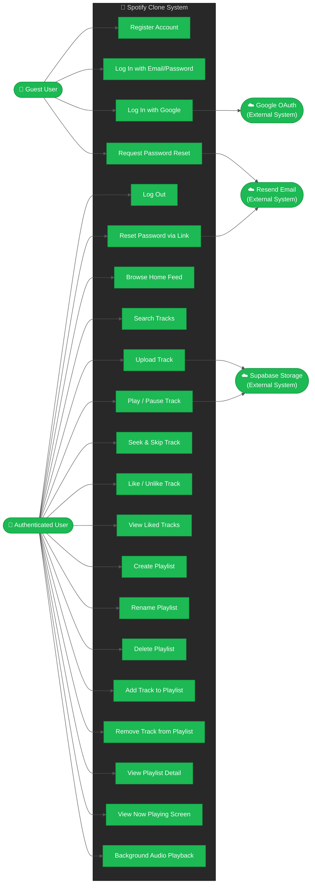

# Use Case Diagram — Spotify Clone

> Follows UML 2.5 conventions. Actors are shown outside the system boundary; use cases are inside.

## Actor Descriptions

| Actor | Role |
|-------|------|
| **Guest User** | Unauthenticated visitor; can register, log in, or request a password reset |
| **Authenticated User** | Logged-in user with full access to all features |
| **Google OAuth** | External identity provider used for social sign-in |
| **Supabase Storage** | External object store for audio files and cover images |
| **Resend Email** | External email delivery service for password reset links |
