# Class Diagram — Spotify Clone

> Follows UML 2.5 conventions. Visibility: `+` public, `-` private.
> Domain entities reflect the Prisma schema; service classes reflect the NestJS backend; client classes reflect the Flutter app.

```mermaid
classDiagram
    direction TB

    %% ── Domain / Entity classes ──────────────────────────────────────────
    class User {
        +String id
        +String email
        +String? passwordHash
        +String? displayName
        +String? googleSub
        +String? avatarUrl
        +DateTime createdAt
        +DateTime updatedAt
    }

    class Track {
        +String id
        +String title
        +String artist
        +String? album
        +Int? durationMs
        +String? coverUrl
        +String? audioUrl
        +String? audioStorageKey
        +String ownerId
        +DateTime createdAt
        +DateTime updatedAt
    }

    class Playlist {
        +String id
        +String name
        +String ownerId
        +DateTime createdAt
        +DateTime updatedAt
    }

    class PlaylistTrack {
        +String id
        +String playlistId
        +String trackId
        +Int position
    }

    class LikedTrack {
        +String id
        +String userId
        +String trackId
        +DateTime createdAt
    }

    %% ── Backend Service classes ───────────────────────────────────────────
    class AuthService {
        -JwtService jwt
        -ConfigService config
        -UsersService users
        -PasswordService password
        -ResetTokenService resetTokens
        -Resend resend
        +signup(data) TokenPair
        +login(data) TokenPair
        +refresh(refreshToken) TokenPair
        +forgotPassword(email) void
        +resetPassword(token, newPassword) void
        +issueTokenPair(userId, email) TokenPair
    }

    class GoogleAuthService {
        -OAuth2Client client
        -ConfigService config
        -UsersService users
        -AuthService authService
        +authenticate(idToken) TokenPair
    }

    class UsersService {
        -PrismaService prisma
        +findByEmail(email) User
        +findById(id) User
        +create(data) User
        +updatePassword(id, hash) User
        +upsertGoogle(data) User
    }

    class TracksService {
        -PrismaService prisma
        -StorageService storage
        -String audioBucket
        -String coversBucket
        +createTrack(userId, audio, cover, dto) Track
        +listTracks(userId) Track[]
        -extractDurationMs(path) Int
        -cleanup(audio, cover) void
    }

    class PlaylistsService {
        -PrismaService prisma
        -StorageService storage
        +create(userId, name) Playlist
        +listUserPlaylists(userId) Playlist[]
        +getPlaylistDetails(id) Playlist
        +renamePlaylist(userId, id, name) Playlist
        +deletePlaylist(userId, id) void
        +addTrackToPlaylist(userId, playlistId, trackId) void
        +removeTrackFromPlaylist(userId, playlistId, trackId) void
        +likeTrack(userId, trackId) void
        +unlikeTrack(userId, trackId) void
        +getLikedTracks(userId) Track[]
    }

    class StorageService {
        -String baseUrl
        -String serviceRoleKey
        +uploadObject(bucket, key, stream, contentType) void
        +createSignedUrl(bucket, key, expiresIn) String
        +publicUrl(bucket, key) String
        +deleteObject(bucket, key) void
    }

    class PasswordService {
        +hash(password) String
        +verify(password, hash) Boolean
    }

    class ResetTokenService {
        -JwtService jwt
        +sign(email) String
        +verify(token) Payload
    }

    class PrismaService {
        +user PrismaUser
        +track PrismaTrack
        +playlist PrismaPlaylist
        +playlistTrack PrismaPlaylistTrack
        +likedTrack PrismaLikedTrack
    }

    %% ── Flutter Client classes ────────────────────────────────────────────
    class AuthNotifier {
        -AuthRepository repository
        +logIn(email, password) void
        +signUp(email, password, displayName) void
        +googleSignIn(idToken) void
        +logOut() void
    }

    class AuthRepository {
        -ApiClient api
        -TokenStorage storage
        +logIn(email, password) String
        +signUp(email, password, displayName) String
        +googleSignIn(idToken) String
        +forgotPassword(email) void
        +resetPassword(token, newPassword) void
    }

    class ApiClient {
        -Dio dio
        -TokenStorage storage
        -String baseUrl
        +get(path) Response
        +post(path, data) Response
        +patch(path, data) Response
        +delete(path) Response
    }

    class TokenStorage {
        +read() TokenPair
        +write(TokenPair) void
        +delete() void
    }

    %% ── Entity Relationships ─────────────────────────────────────────────
    User "1" --> "0..*" Track : owns
    User "1" --> "0..*" Playlist : owns
    User "1" --> "0..*" LikedTrack : likes
    Playlist "1" --> "0..*" PlaylistTrack : contains
    Track "1" --> "0..*" PlaylistTrack : referenced in
    Track "1" --> "0..*" LikedTrack : liked via

    %% ── Service Dependencies ─────────────────────────────────────────────
    AuthService --> UsersService : uses
    AuthService --> PasswordService : uses
    AuthService --> ResetTokenService : uses
    GoogleAuthService --> UsersService : uses
    GoogleAuthService --> AuthService : uses
    TracksService --> PrismaService : uses
    TracksService --> StorageService : uses
    PlaylistsService --> PrismaService : uses
    PlaylistsService --> StorageService : uses
    UsersService --> PrismaService : uses

    %% ── Client Dependencies ──────────────────────────────────────────────
    AuthNotifier --> AuthRepository : uses
    AuthRepository --> ApiClient : uses
    ApiClient --> TokenStorage : uses
```

