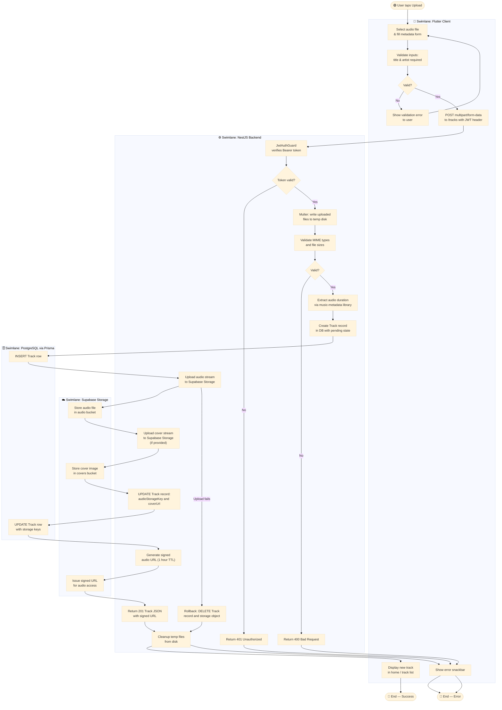

# Activity Diagram with Swimlanes — Track Upload Flow

> Follows UML 2.5 conventions. Swimlanes represent distinct system participants.
> Shows the complete Track Upload flow including validation, storage, database writes, and rollback on failure.

## Swimlane Responsibilities

| Swimlane | Responsibility |
|----------|---------------|
| **Flutter Client** | User input, validation, multipart HTTP request, displaying results or errors |
| **NestJS Backend** | JWT auth guard, file handling via Multer, validation, business logic, orchestration |
| **Supabase Storage** | Persisting audio and cover image files; generating signed access URLs |
| **PostgreSQL** | Persisting Track metadata; rollback-safe two-phase write (INSERT then UPDATE) |
