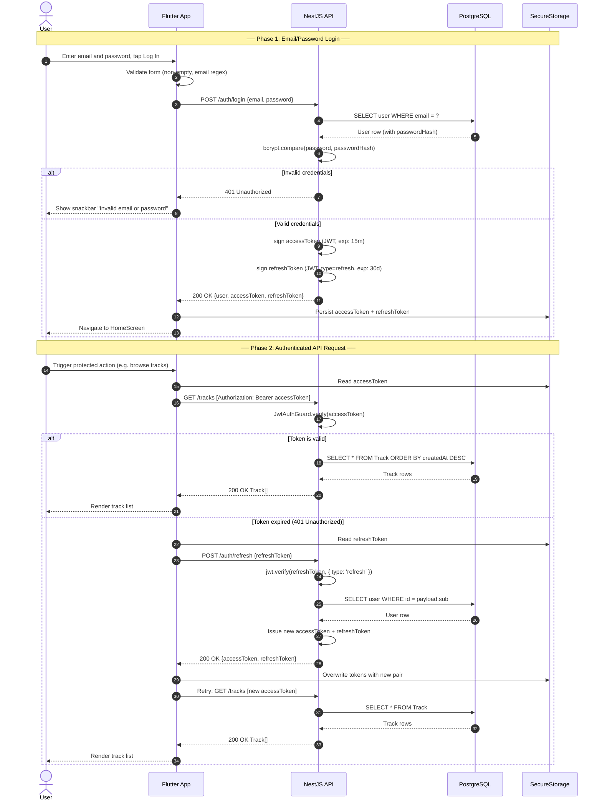

# Sequence Diagram — User Authentication (Login + Token Refresh)

> Follows UML 2.5 conventions. Shows the complete email/password login flow,
> protected API request handling, and automatic silent token refresh on expiry.

## Key Design Decisions

| Decision | Detail |
|----------|--------|
| **Access Token TTL** | 15 minutes — short-lived to limit exposure if intercepted |
| **Refresh Token TTL** | 30 days — stored securely in device `flutter_secure_storage` |
| **Silent refresh** | The client automatically retries any failed 401 request after refreshing — no user interaction needed |
| **Refresh token type claim** | Refresh tokens carry `type: 'refresh'` in their payload, preventing access tokens from being used as refresh tokens |
