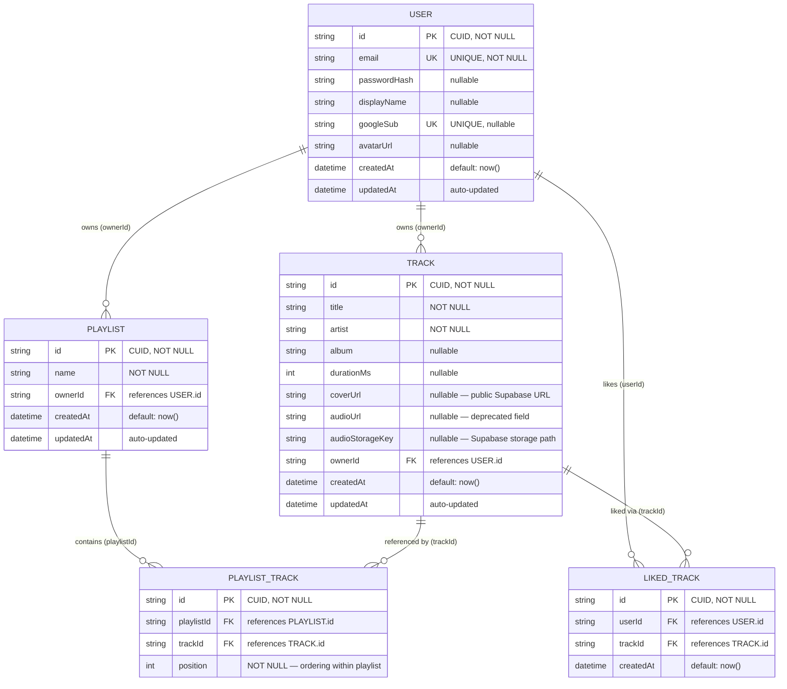

# Entity-Relationship (ER) Diagram — Spotify Clone

> Follows standard ER notation with crow's foot cardinality.
> Reflects the Prisma schema (`backend/prisma/schema.prisma`) exactly.

## Constraints & Notes

| Table | Constraint | Detail |
|-------|-----------|--------|
| `USER` | `email` UNIQUE | One account per email address |
| `USER` | `googleSub` UNIQUE | One Google identity per account |
| `PLAYLIST_TRACK` | `(playlistId, trackId)` UNIQUE | A track can appear at most once in a playlist |
| `LIKED_TRACK` | `(userId, trackId)` UNIQUE | A user can like a track at most once |
| All FKs | `ON DELETE CASCADE` | Deleting a User removes all their Tracks, Playlists, and Likes |

## Storage Notes

- **Audio files** → Supabase `audio` bucket, keyed as `audio/{trackId}.{ext}`. Access via **signed URLs** (1 hour TTL), regenerated on every list/detail request.
- **Cover images** → Supabase `covers` bucket, keyed as `covers/{trackId}.{ext}`. Access via **permanent public URLs** stored in `TRACK.coverUrl`.
